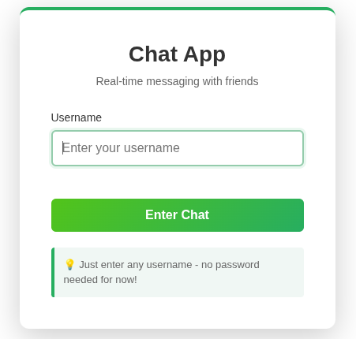

# Chat App (Java + Spring + Vanilla JS)

**Version:** 0.1.0

A simple real-time chat web application built to learn **Java**, **Spring Boot**, and **WebSockets**.  
The project starts small and grows step by step — from a local chat to a deployable web app.

## 🎯 Goals
- Understand full-stack development with Spring Boot and vanilla JS.
- Practice building REST and WebSocket endpoints.
- Learn basic authentication, database integration, and deployment.

## 🧰 Tech Stack
- **Backend:** Java 25, Spring Boot, WebSocket, JPA, PostgreSQL  
- **Frontend:** HTML, CSS, JavaScript  
- **Tools:** Gradle, Git, VS Code

## ✨ Features
  - ✅ Real-time messaging with WebSockets
  - ✅ Online users list
  - ✅ Message edit and delete
  - ✅ Typing indicators
  - ✅ Emoji picker
  - ✅ Responsive design for mobile and desktop

## Screenshots

