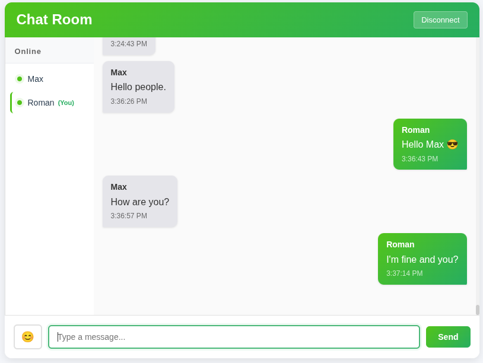

# Chat App (Java + Spring + Vanilla JS)

**Version:** 0.1.3

A simple real-time chat web application built to learn **Java**, **Spring Boot**, and **WebSockets**.  
The project starts small and grows step by step — from a local chat to a deployable web app.

## 🎯 Goals
- Understand full-stack development with Spring Boot and vanilla JS.
- Practice building REST and WebSocket endpoints.
- Learn basic authentication, database integration, and deployment.

## 🧰 Tech Stack
- **Backend:** Java 25, Spring Boot, WebSocket, JPA, PostgreSQL  
- **Frontend:** HTML, CSS, JavaScript  
- **Tools:** Gradle, Git, VS Code

## ✨ Features
- ✅ Real-time messaging with WebSockets
- ✅ Online users list
- ✅ Message edit and delete
- ✅ Typing indicators
- ✅ Emoji picker
- ✅ Responsive design for mobile and desktop

## Screenshots



## Setup guide

### Prerequisites
- **Java 25** or higher
- **PostgreSQL** (any recent version)
- **Gradle** (included via wrapper)

### Database Setup

1. **Install PostgreSQL** if you haven't already

2. **Create the database:**
```sql
CREATE DATABASE chat_db;
```

3. **Create a PostgreSQL user (or use existing one):**
```sql
CREATE USER your_username WITH PASSWORD 'your_password';
GRANT ALL PRIVILEGES ON DATABASE chat_db TO your_username;
```

### Configuration

Create `src/main/resources/application.properties` file with your database credentials:
```properties
# --- General ---
spring.application.name=chatapp

# --- Database ---
spring.datasource.url=jdbc:postgresql://localhost:5432/chat_db
spring.datasource.username=YOUR_POSTGRES_USERNAME
spring.datasource.password=YOUR_POSTGRES_PASSWORD
spring.datasource.driver-class-name=org.postgresql.Driver

# --- JPA / Hibernate ---
spring.jpa.hibernate.ddl-auto=update
spring.jpa.show-sql=false

# --- Thymeleaf ---
spring.thymeleaf.cache=true
```
**Replace:**
- `YOUR_POSTGRES_USERNAME` with your PostgreSQL username (e.g., postgres)
- `YOUR_POSTGRES_PASSWORD` with your PostgreSQL password

> ***Note:** The `application.properties` file is not included in the repository for security reasons. You must create it yourself.*

### Running the Application

1. **Clone the repository:**
```bash
git clone https://github.com/Romanhan/chat-app.git
cd chat-app
```
2. **Run the application:**
```bash
./gradlew bootRun
```
3. **Open your browser:** http://localhost:8080
4. **Start chatting!** 🎉
- Enter a username on the login page
- Send messages in real-time
- Try opening multiple browser tabs to simulate different users